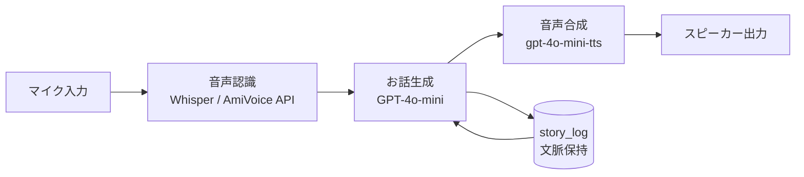

# AIおはなし機 🧸

> 話しかけると、その場で毎回ちがうお話を返してくれる、子ども向けの音声対話デバイス。
> 画面を使わず、声だけで遊べます。Raspberry Pi 上で常駐動作。

4歳の娘に「おはなしして」とせがまれ続ける日々のなかで、
「画面のない、声だけでおしゃべりしてくれる箱」がほしくて自作しました。
ハードウェア × 音声AI × 育児のリアルを詰め込んだ個人プロジェクトです。

---

## ✨ 特徴 / Features

- 🎙 **声で対話** — マイクに話しかけるだけ。画面なしで完結。
- 📚 **毎回ちがう物語** — LLM（GPT-4o-mini）でその場生成。`story_log` で文脈を保持し、話がつながる。
- 🎚 **会話レベル（Lv1〜3）** — 子どもの年齢・反応に合わせて語彙や長さを自動調整。
- 🗂 **テーマ提案** — 14ジャンル・約150テーマから「なにをお話しする？」をガイド。
- 🔊 **自然な読み上げ** — `gpt-4o-mini-tts` にひらがな前処理をかけて、子どもが聞き取りやすい音声に。
- 📝 **ログ記録** — 対話のWAV録音・CSVログをローカル保存（※後述のプライバシー方針によりリポジトリには含めません）。

---

## 🧩 システム構成 / Architecture



> ※ 音声認識・トリガー方式（ウェイクワード / Enterキー等）は実装に合わせて記載を調整してください。
詳しい仕組みは Zenn の技術記事で解説しています → [子どもとAIが一緒にへんてこなお話を作る「AIおはなし機」をAmiVoice + GPT-4oで作った話](https://zenn.dev/kta805/articles/article_ai_ohanashiki)
---

## 🛠 必要なもの / Requirements

- Raspberry Pi 4（推奨）
- USBマイク・スピーカー（またはUSBオーディオ）
- Python 3.10 以上
- OpenAI API キー
- （利用している場合）AmiVoice API のキー

---

## 🚀 セットアップ / Setup

```bash
# 1. クローン
git clone https://github.com/<your-account>/ai-ohanashi-ki.git
cd ai-ohanashi-ki

# 2. 仮想環境
python -m venv .venv
source .venv/bin/activate

# 3. 依存パッケージ
pip install -r requirements.txt

# 4. 環境変数（APIキー）を設定
cp .env.example .env
#  → .env を開いて自分のキーを記入

# 5. 実行（Raspberry Pi 本番）
python main.py

#    PCで動作確認するとき
python main_pc.py
```

### 常駐化（systemd）

Raspberry Pi 起動時に自動で立ち上げる場合：

```bash
sudo cp systemd/ohanashi.service /etc/systemd/system/
sudo systemctl daemon-reload
sudo systemctl enable --now ohanashi.service
```

---

## 🎮 使い方 / Usage

起動後、「**うさぎさんのおはなしして**」のように話しかけると、その場で物語が生まれます。
同じテーマでも毎回ちがうお話が返ってきます。

---

## 📁 ディレクトリ構成 / Structure

```
ai-ohanashi-ki/
├── README.md
├── LICENSE
├── .gitignore
├── .env.example
├── requirements.txt
├── main.py             # Raspberry Pi 本番用
├── main_pc.py          # PC開発・動作確認用
├── themes.py           # ジャンル・テーマ定義
├── tests/
│   ├── test_amivoice.py    # 音声認識（AmiVoice）
│   ├── test_story.py       # お話生成
│   └── test_wakeword.py    # ウェイクワード検出
├── systemd/
│   └── ohanashi.service    # 常駐化（任意）
├── recordings/         # ローカル専用（.gitignore対象）
└── ohanashi_log.csv    # ローカル専用（.gitignore対象）
```

> テストスクリプトは `tests/` にまとめると見通しがよくなります（そのままルート直下でも動作上は問題ありません）。

---

## 🧱 技術スタック / Tech Stack

Python / OpenAI API（GPT-4o-mini, gpt-4o-mini-tts）/ 音声認識（Whisper・AmiVoice API）/ Raspberry Pi 4 / systemd

---

## 📝 関連記事

開発の技術的な詳細は Zenn にまとめています → `https://zenn.dev/kta805/articles/article_ai_ohanashiki`

---

## 🔒 プライバシー方針

このデバイスは子どもとの対話を扱います。**録音（WAV）・対話ログ（CSV）には子どもの音声や発話が含まれるため、リポジトリには一切含めません。** `.gitignore` で除外済みです。公開するのはコードと仕組みのみです。

---

## 📄 ライセンス

MIT License（予定 / 変更可）。詳細は `LICENSE` を参照。
